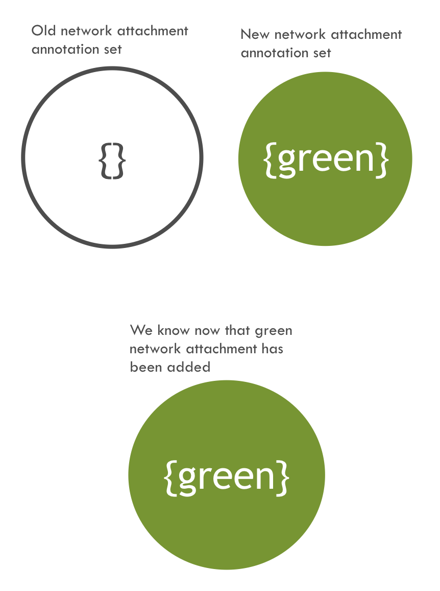
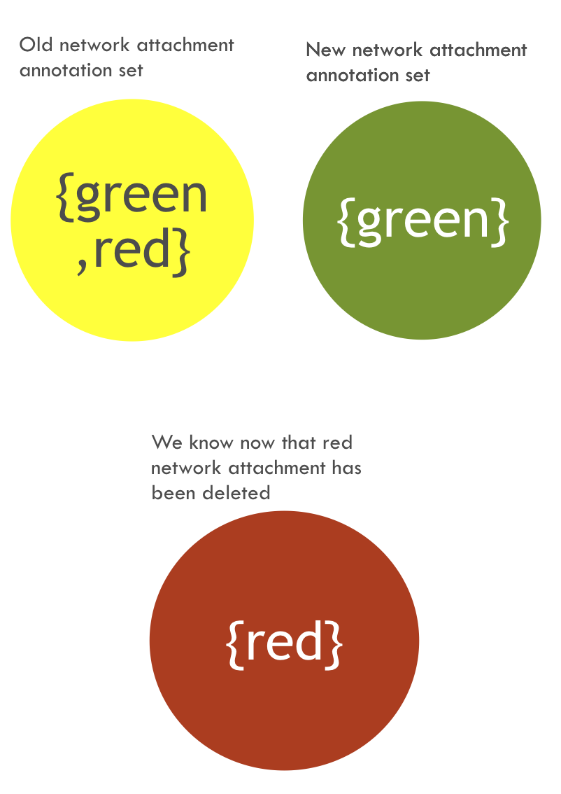

# INTRODUCTION

This repo contains the source code of Kaloom's Kubernetes Podagent

## What is it?

A controller that runs on each Kubernetes’ node

## Why we need it?

To dynamically add/delete a network interface(s) into a running Pod without restarting it (e.g. vrouters, VNF usecases)

## What it does

Watches Pods’ network attachment annotations using Kubernetes’ apiserver and react to changes to it:
* Finds a Pod’s network namespace from the container runtime engine
* Invokes the cni-plugin to add/del network interface dynamically into the Pod’s network namespace

## Podagent interaction with other components

## Adding a network attachment

Let assume we started a Pod with no network attachments (i.e. just the default network on *eth0*), once it's *RUNNING*, we added a *green* network attachment annotation

|                                                              |                          |
|--------------------------------------------------------------|:--------------------------|
|| The watch in this case will fire, the received data from the watch would contains (among other things) the old and new network attachmenet data, we can deduce from the constructed sets that the *green* network attachment has been added, the podagent will:|
||* find the network namespace from the container runtime interface using the Pod’s container id
||* prepare the cni environment variables parameters; network attachment name will be amongst them (i.e. in *CNI_ARGS*)
||* invoke the cni-plugin with the collected cni parameters, *CNI_COMMAND=ADD*
||* kactus, Kaloom’s meta cni-plugin, knows how to works with dynamic network attachments:
||`    `- if the network attachment name is present in *CNI_ARGS* it handle the dynamic network attachment usecase
||`    `- uses consistent device naming based on the network attachment name, it’s the first 12 characters of the md5 hash of the name prefixed with net, for *green* it’s *net9f27410725ab*
||`    `- delegate the creation of the network interface to the cni-plugin associated with the *green* network attachment

## Deleting a network attachment

Let assume we have a *RUNNING* Pod with 2 network attachements *red* and *green*, while it's *RUNNING*, we deleted off the network attachments annotation list the *red* network attachment

|                                                              |                          |
|--------------------------------------------------------------|:--------------------------|
|| The watch in this case will fire, the received data from the watch would contains (among other things) the old and new network attachmenet data, we can deduce from the constructed sets that the *red* network attachment has been deleted, the podagent will:|
||* find the network namespace from the container runtime interface using the Pod’s container id
||* prepare the cni environment variables parameters; network attachment name will be amongst them (i.e. in *CNI_ARGS*)
||* invoke the cni-plugin with the collected cni parameters, *CNI_COMMAND=DEL*
||* kactus, Kaloom’s meta cni-plugin, knows how to works with dynamic network attachments:
||`    `- if the network attachment name is present in *CNI_ARGS* it handle the dynamic network attachment usecase
||`    `- uses consistent device naming based on the network attachment name, it’s the first 12 characters of the md5 hash of the name prefixed with net, for *red* it’s *netbda9643ac660*
||`    `- delegate the deletion of the network interface to the cni-plugin associated with the *red* network attachment

# HOW TO BUILD

> `./build.sh`

## For developpers:

if you're adding a new dependency package to the project you need to use `gradle`, otherwise running the `./build.sh` script should do

`gradle` required `java` to be installed, its used to generate the dependencies (using `gogradle` plugin), update the `gogradle.lock`, build the project and update the go `vendor` directory if needed

* update build.gradle
* generate a new `gogradle.lock` file:
  > `./gradlew lock`
* build the project (the `build` gradle task would trigger an update to the `vendor` directory using the `gogradle.lock` if needed):
  > `./gradlew build`

  or simply

  > `./gradlew`
* submit a merge request

### other useful info:

* updating only the vendor directory can be done with:
  > `./gradlew vendor`
* to get a list of available `gradle` tasks:
  > `./gradlew tasks`

# Setup

How to deploy the `podagent`

### pre-requiste
`kactus` Kaloom's cni-plugin which knows how to works with dynamic network attachments

see [kactus cni-plugin repo](https://github.com/kaloom/kubernetes-kactus-cni-plugin)

## As DaemonSet

1. [setup kactus](https://github.com/kaloom/kubernetes-kactus-cni-plugin/README.md) as the master cni-plugin in your Kubernetes cluster

2. create a Kubernetes service account, cluster role and cluster role binding for the podagent:

> $ `kubectl apply -f manifests/podagent-serviceaccount-and-rbac.yaml`

3. delopy the podagent as a daemon set:

> $ `kubectl apply -f manifests/podagent-ds.yaml`

### Note
Currently, to deploy the podagent as DaemonSet
* *selinux* should not be in *enforced* mode (*permissive* mode is okay):
  > \# `setenforce permissive`

  > \# `sed -i 's/^SELINUX=.*/SELINUX=permissive/g' /etc/selinux/config`

* it's run as a *privileged* container and requires access to Docker's `/var/run/docker.sock` unix socket (Docker is the only Container Runtime Engine supported right now)

## As systemd service

1. [setup kactus](https://github.com/kaloom/kubernetes-kactus-cni-plugin/README.md) as the master cni-plugin in your Kubernetes cluster

2. build the podagent rpm package

> $ `./scripts/build-rpm.sh`

3. copy and install the produced package in the step above to all the nodes in Kubernetes cluster:

> $ `sudo rpm -ivh podagent-*.rpm`

> $ `sudo systemctl start podagent`

> $ `sudo systemctl enable podagent`

4. create a Kubernetes service account, cluster role and cluster role binding for the podagent:

> $ `kubectl apply -f manifests/podagent-serviceaccount-and-rbac.yaml`

5. create the `podagent-kubeconfig.yaml` file:

> $ `./scripts/create-kubeconfig.sh`

6. copy the produced `/tmp/kubeconfig/podagent-kubeconfig.yaml` to each node in Kubernetes cluster under `/opt/kaloom/etc/`

> $ sudo cp /tmp/kubeconfig/podagent-kubeconfig.yaml /opt/kaloom/etc/

# Example

We will deploy a simple application (Linux alpine) with only the default network attachment (i.e. eth0 setup by the master cni-plugin).
Than add a network attachment called `data` which uses a `bridge` cni-plugin

Let first provision the `data` network attachment:

> $ `kubectl apply -f examples/data-net.yaml`

Than delpoy alpine with 2 replicas:

> $ `kubectl run hello-multi-net --image=alpine --replicas=2 -- top`

Add the `data` network attachment to the first pod:

> $ `./scripts/add-network-annotation.sh $(kubectl get pod -l run=hello-multi-net -o name | cut -d/ -f2 | head -1) data`

Verify that a new network interface called `net8d777f385d3d` is present in the pod

> $ `kubectl exec -t $(kubectl get pod -l run=hello-multi-net -o name | cut -d/ -f2 | head -1) -- ip a`

Verify that the pod didn't get re-started

> $ `kubectl get pod -l run=hello-multi-net -o wide | grep $(kubectl get pod -l run=hello-multi-net -o name | cut -d/ -f2 | head -1)`

Delete the `data` network attachment off the first pod:

> $ `./scripts/del-network-annotation.sh $(kubectl get pod -l run=hello-multi-net -o name | cut -d/ -f2 | head -1) data`

Verify that `net8d777f385d3d` is gone from the pod:

> $ `kubectl exec -t $(kubectl get pod -l run=hello-multi-net -o name | cut -d/ -f2 | head -1) -- ip a`

Verify that the pod didn't get re-started

> $ `kubectl get pod -l run=hello-multi-net -o wide | grep $(kubectl get pod -l run=hello-multi-net -o name | cut -d/ -f2 | head -1)`

Repeat the same thing with the second pod:

> $ `./scripts/add-network-annotation.sh $(kubectl get pod -l run=hello-multi-net -o name | cut -d/ -f2 | tail -1) data`

## Note
1. for the above example, make sure that the `data-br` is present on all the nodes

> $ `brctl show data-br`
